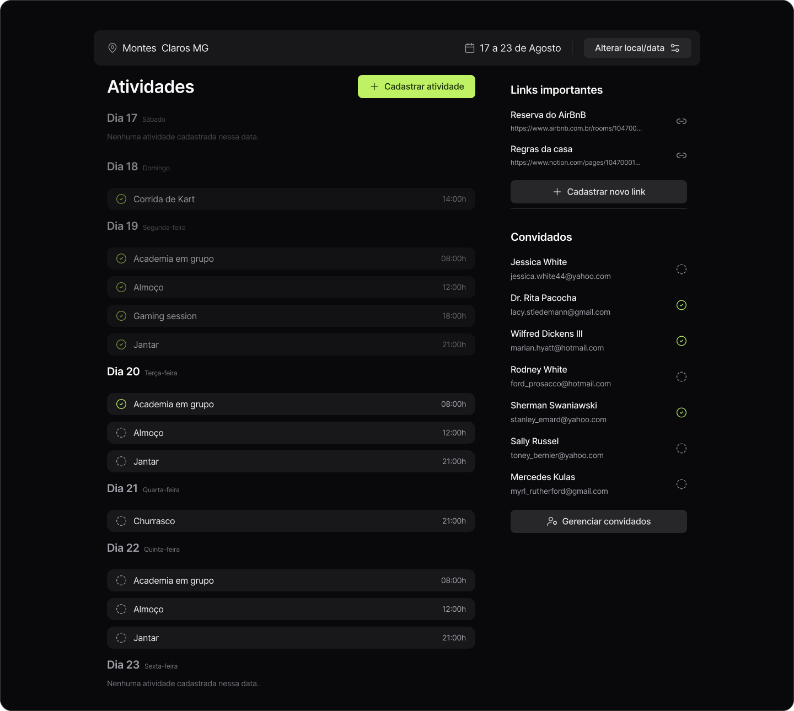

<h1 align="center">Planejador de Viagens</h1>

Aplicação Full Stack que consiste em gerenciar e organizar todos os passos de uma viagem. Projeto desenvolvido na NLW Journey da Rocketseat.
 

  <a href="#-tecnologias">Tecnologias</a>&nbsp;&nbsp;&nbsp;|&nbsp;&nbsp;&nbsp;
  <a href="#-projeto">Projeto</a>&nbsp;&nbsp;&nbsp;|&nbsp;&nbsp;&nbsp;
  <a href="#-layout">Layout</a>&nbsp;&nbsp;&nbsp;|&nbsp;&nbsp;&nbsp;
  <a href="#memo-licença">Licença</a>

  

 

  

## 🚀 Tecnologias

Esse projeto foi desenvolvido com as seguintes tecnologias:

<strong>FRONTEND</strong>

- React - Vite
- TypeScript
- Tailwind
- Node JS

<strong>BACKEND</strong>

- Node JS
- Prisma

## 💻 Projeto

O projeto consiste em um sistema em que pode ser criado todo o planejamento de atividades de uma viagem. O usuario pode inserir o local da viagem; definir a data de inicio e data de fim; inserir convidados e listar atividades para desenvolver em cada dia.

## 💻 Usage

<strong>BACKEND</strong>

1.                              Instale as depedencias do NodeJs: npm install
2.                              Start a API do servidor nodejs: npm run dev
3.                              Documentação da API: https://nlw-journey.apidocumentation.com/reference

<strong>FRONTEND</strong>

1.                              Instale as depedencias: npm install
2.                              Inicialize o projeto localmente: npm run dev

## 🔖 Layout

Você pode visualizar o layout do projeto através [DESSE LINK](. É necessário ter conta no [Figma](https://figma.com) para acessá-lo.

## :memo: Licença

Esse projeto está sob a licença MIT.

---
